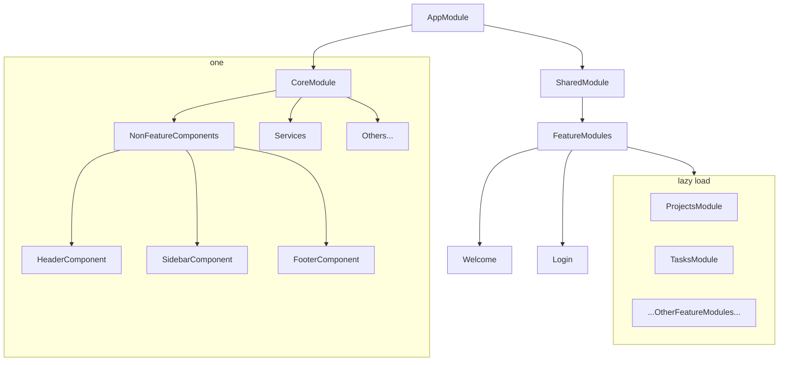

```mermaid
flowchart TB;
    AppModule-->CoreModule;
    AppModule-->SharedModule;
    subgraph one
    CoreModule-->NonFeatureComponents;
    CoreModule-->Services;
    CoreModule-->Others...;
    NonFeatureComponents-->HeaderComponent;
    NonFeatureComponents-->SidebarComponent;
    NonFeatureComponents-->FooterComponent;
    end
    FeatureModules-->Welcome;
    FeatureModules-->Login;
    FeatureModules-->ide1
    subgraph ide1 [lazy load]
    ProjectsModule;
    TasksModule;
    ...OtherFeatureModules...;
    end
    SharedModule-->FeatureModules;
```
CSS Flexbox https://www.w3schools.com/css/css3_flexbox.asp
